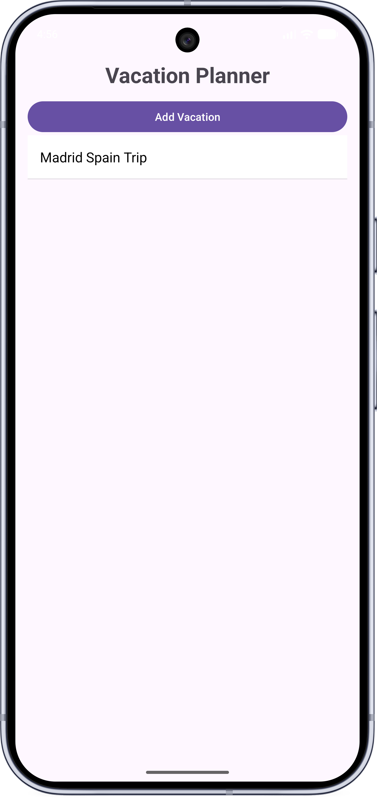
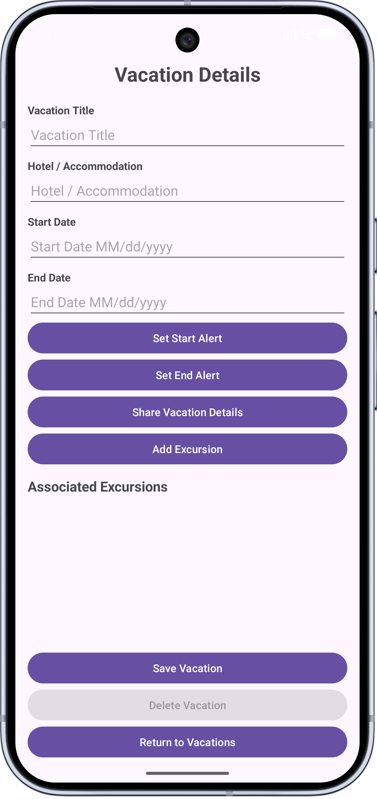
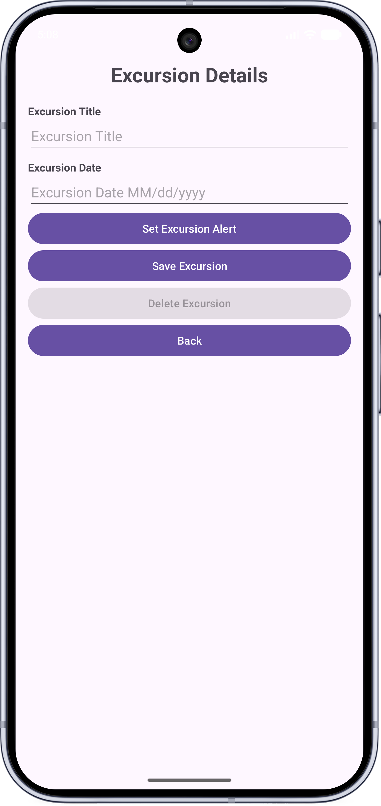
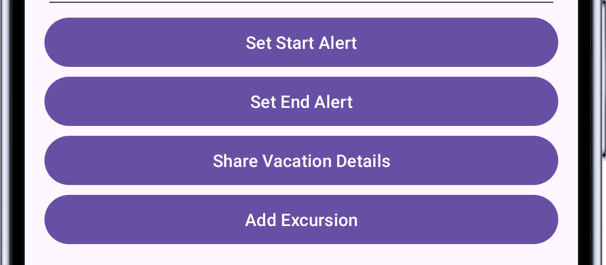
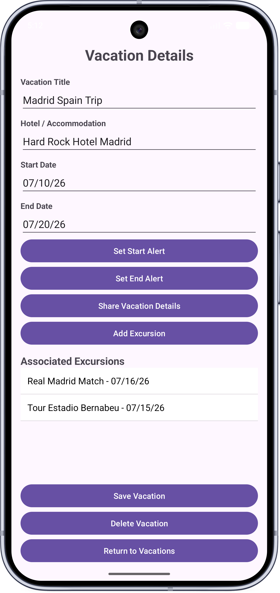

# Vacation Planner Mobile App

A mobile Android application built with Java, Android Studio, Room, and SQLite that allows users to manage vacations and excursions through persistent local storage.

## Features
- Create, edit, and delete vacations
- Add and manage excursions
- Vacation and excursion notifications
- Persistent local database storage using Room/SQLite
- CRUD functionality
- Input validation
- Sharing functionality

## Tech Stack
- Java
- Android Studio
- Room Database
- SQLite
- Android SDK

## Screenshots
### Home Screen

### Add Vacation Screen

### Excursion Screen

### Notification Example

### Excursion Added

## What I Learned
This project strengthened my experience with Android development, Room database persistence, CRUD operations, validation, notifications, and mobile application architecture.
